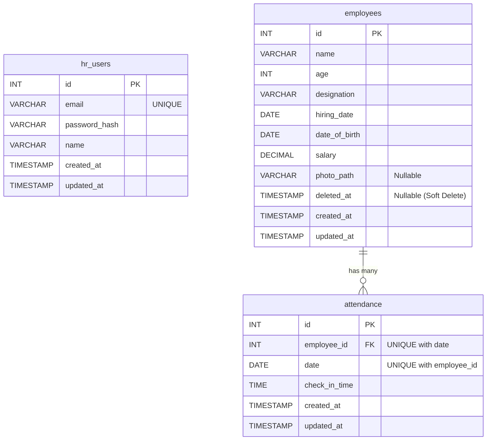

# Entity Relationship Diagram (ERD)

Here is the Entity Relationship Diagram representing the database schema for the HR Management API.

## Overview of Relationships

1. **`hr_users`**: This table is standalone. It is used to authenticate the internal HR staff manipulating the system via the `/api/v1/auth/login` endpoint.
2. **`employees`**: The central operational table. It contains a `has many` (one-to-many) relationship with the `attendance` table. If an employee is deleted, their attendance records are cascade-deleted.
3. **`attendance`**: Contains a foreign key `employee_id` referencing the `employees` table. There is a composite unique constraint on `(employee_id, date)` to ensure an employee can only have one check-in record per day.
